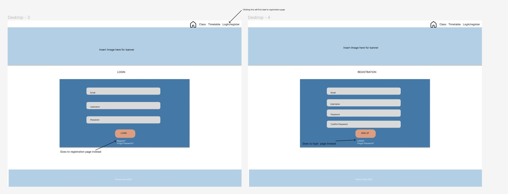

# t3a2-fitness-class
# FitnessNow

## Resources

- <a href= https://github.com/jennlai95/t3a2-fitness-now-front-end > Front end repo </a>
-  <a href= https://github.com/jennlai95/t3a2-fitness-now-back-end > Back end repo </a>
- [Notion project management](https://flashy-mushroom-c40.notion.site/cd721472bb514036bebd6fdf9146bf67?v=584439e240ef474f81ce5f17940f705f&pvs=4 "Notion")
- [Wireframes-figma](https://www.figma.com/file/lpl5nVrmbn0s1fxrgEks3l/Wireframe-Fitness-Now?type=design&node-id=0%3A1&mode=design&t=oifo3NLTtMHAkr5n-1)

# Part A 
# Description 

#### Description of  your website, including:
- Purpose
- Functionality /features
- Target audience
- Tech stack

## Purpose

Fitness class booking system 
This app is going to deliver a booking system for fitness lovers everywhere to be able to book classes in their local gym. This allows the users to create account, browse the different open classes and time available and make payments for the classes. 

Previously, the gym would take the payments and bookings manually and taking attendance on spreadsheets. 
This could lead to human error and also limits the booking times to business hours. With this app, clients can make bookings at anytime from home and on their phone and can easily see the availability of the classes. 

## Functionality/ feature
#### User registration and Authentication 
- To book classes, users must create new accounts first, so they can be contacted for any changes in class times and also to make payment and keep track of their user date. 
- Users can create, edit and delete own account

- Admin users will have authorisation to make changes to regular users such as deleting or creating them. Admin users can also make posts for available classes and update them as they go. 

#### Class timetable  

- Users can search for the different types of classes such as pilates, yoga, group training classes etc. 
- Users can view all the available sessions in a weekly time. 
- Admins can retrieve booking details for each specific classes and can look up users details so they can update them on any changes. 
- Admins can create new classes or update or delete the class timetable

#### Booking screen 
- clients can choose specific time slot to attend the chosen class from the search results
- will prompt clients to login/ register if not already logged in 

#### Nice to have 

#### Payment screen 

- After booking you can pay a single class or book a set number of classes as credit. 

### FOR ADMIN/STAFF ONLY
#### Class timetable and search update
- Admins can update the weekly class schedule and assign staff/admin to each class. 

#### view of all users 
- Allows admins to see all the clients available and also the clients attending specific class

## Target Audience

The application target audience are the Clients e.g new or current fitness class goers and the Gym and their staff. Staff can create their own classes and assign the classes to a booking slot. 

The target audience is then split between the clients and the gym who is hosting the classes to the clients. 

## Tech Stack

#### Front end 
- Javascript 
- HTML
- CSS

#### Backend 

- NodeJS
- ExpressJS

#### Database 

- MongoDB
- Mongoose

#### Deployment 

- Heroku - back-end
- Netlify - front-end

#### Testing 

- Jest

#### Others 

- Figma 
- Draw.io

#### Source control 

- Github, Git

#### Project Management 

Notion

## R2 Dataflow Diagram

## R3 Application Architecture Diagram

## R4 User Stories 

#### Admin/Staff

- As a class instructor I would like to create appointments online
- As a class instructor I would like to update the class timing online if any changes need to be made and update the current bookings 
- As a class instructor I would like to view current clients that have booked/signed up to the class 

#### Client/ users

- As a potential client, I want to see the available classes and time slot online
- As a client, I want to have a confirmation of the class time and pricing once I've booked a slot 
- As a client, I want to have the option to cancel any upcoming class bookings if I can no longer attend. 

### PERSONAS

### Admin users
#### 1. Admin staff 
- John  - Staff/ Class instructor for the gym
I am John and I'm a very passionate yoga instructor. I'm 32 years old. I like to view the class bookings ahead of time so I can anticipate who will be joining. As I have a lot of regular clients I also like to tailor my group classes to their needs and level
- What: I want to be able to view clients and manage incoming class bookings 
- Why: This allows me to view who will be attending each class and anticipate the numbers better

#### 2. Admin Staff

- Esther - Staff 
My name is Esther I work as as the administration staff for Fitness Now. I'm 25 years old. I am very detail oriented and I love clear and easy organisation. Currently managing the upcoming bookings on Excel makes it hard to keep track of as its not always up to date. 
- What: I want a way to manage the user accounts and view all relevant details of the registered users. Furthermore, I want to be able to keep track of all upcoming classes and who has booked the classes
- Why: This allows me to view user information if needed and also delete/deactivate any user accounts when they request it. I also want to be able to add new bookings or view/delete bookings. 

#### 3. Admin Staff
- Chloe - Class instructor 
I am Chloe, I have been working at this studio as a pilates instructor for 2 years. I am 28 years old. I love working at this studio as its very flexible with timing. As a preference I prefer pastel colours for our website as it matches our current studio
- What: I want the ability to change the schedule on the bookings
- Why: This is so I can add, edit or delete specific class and their details on the the website. This includes editing class times , description such as which instructor is running each class.

### Clients

- Dylan - Client
My name is Dylan I'm 36 years old. I am a yoga lover however I am also a very busy, sometimes I have to cancel my classes and it's easier if I can do it over the app rather than over the phone
- What: I want to be able to view and cancel current bookings 
- Why: Sometimes there is an unplanned interruption and I need to cancel my upcoming booking. It will be nice to be able to do this via the website/app as I may be too busy to call to cancel

- Mary - Client 
- My name is Mary and I am a semi-casual client. I sometimes attend classes 2/3 times per weeks depending on my schedule. I also like to book classes ahead of time so I can get a spot in the class of my preferred time
- What: I want to be notified if a class has schedule is moved 
- Why: This is so I can plan my time better and know if the class was moved so I can then cancel or change class

- Stuart - Client 
- I am an avid fitness lover and I have just moved to the area. I am currently looking for a new fitness studio and being able to sign up online makes me more likely to sign up for regular visits at the studio.
- What: I want to be able to register/login 
- Why: This is so  I can keep track of my account and upcoming bookings so that I can plan my own schedule. 

## R5 Wireframe

Website colours

Temporary website colours 

Website colour palette after user feedback

Colours were changed to a more muted palette due to staff preference

### Desktop  Wireframes

Screenshots and link 

[figma](https://www.figma.com/file/lpl5nVrmbn0s1fxrgEks3l/Wireframe-Fitness-Now?type=design&node-id=0%3A1&mode=design&t=oifo3NLTtMHAkr5n-1)

#### Home page & Class &  Schedule

Desktop home page

Desktop class schedule/timetable

#### Login & registration

#### Booking pages

#### ADMIN ONLY VIEW 

#### User profile page - all users

### Mobile  Wireframes
#### Home page & Class Schedule

#### Login and Registration

#### Booking pages and profile

#### Admin only pages

### Tablet Wireframes

#### Home, class and timetable

#### Login and registration

#### Booking pages

#### profile page

#### Admin only views

## R6  Screenshots of your Trello board throughout the duration of the project

Project management was done on notion due to ease of access and the editable template. 

[Notion project management](https://flashy-mushroom-c40.notion.site/cd721472bb514036bebd6fdf9146bf67?v=584439e240ef474f81ce5f17940f705f&pvs=4 "Notion")
DAY 1 

Week 2

Part B overview planning

Final week

Final day

